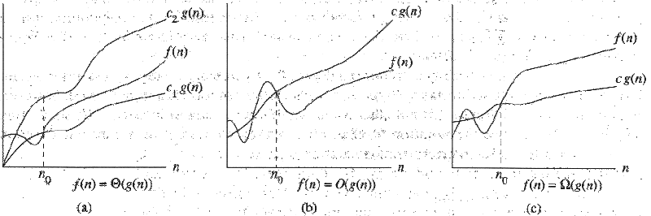

Na análise de algoritmos é comum definirmos o **tempo de execução** de um algoritmo sob uma entrada específica como sendo o número de “_passos_” executados. A noção abstrata de um passo de execução é conveniente para que o tempo de execução de um algoritmo seja independente de máquina. Assumimos que uma quantidade de tempo constante é requerida para executar cada linha do pseudocódigo do algoritmo. Assim, a execução de cada linha leva o tempo , constante.

Apesar de independente de máquina, podemos fazer afirmações concretas sobre o tempo de execução de um algoritmo: “_Sobre qualquer entrada de tamanho , o algoritmo executa com no máximo passos._”

Entretanto, essa abordagem não é prática por várias razões, incluindo ser trabalhosa e detalhada demais. Além disso, um dos principais objetivos da análise de algoritmos é identificar classes de algoritmos com comportamentos similares, e para isso nossa descrição precisa ter um nível a mais de granularidade — o que eu quero dizer com isso é que nossa descrição precisa ser mais genérica, para que as similaridades de algoritmos diferentes sejam aparentes.

Um dos comportamentos que estamos interessados é a taxa de crescimento das várias funções do algoritmo sobre o tamanho da entrada, por exemplo, o tempo de execução — em outras palavras, o quão rápido o tempo de execução cresce com o tamanho da entrada. E uma maneira genérica de avaliar tal comportamento é por meio da **análise assintótica** dessas funções, qual é insensível a fatores constantes ou termos de baixa ordem. Ou seja, se um determinado algoritmo tem um tempo de execução , o que nos interessa saber é que a sua taxa de crescimento é , ou quadrática.

### Limites Assintóticos Superiores –

###   

Para uma dada função , denotamos por (conhecido como notação **_Big-O_** e pronunciado “big-oh de de ” ou simplesmente “oh de de ”) o conjunto de funções

Em outras palavras, uma função pertence ao conjunto se existe uma constante positiva tal que é um limite superior de para valores de suficientemente grandes, ou seja, é um limite superior assintótico de — o mais correto seria escrevermos , mas também é comum escrevermos para denotar o mesmo.

### Limites Assintóticos Inferiores –

###   

A notação (.) funciona da mesma maneira que a notação (.), exceto que esta descreve o limite assintótico _inferior_ da função. Então, formalmente, para uma dada função denotamos por (pronunciado “big-omega de de ” ou simplesmente “omega de de ”) o conjunto de funções

Da maneira análoga ao limite superior, dizemos que existe uma constante positiva tal que é um limite assintótico inferior de para valores de suficientemente grandes. Em outras palavras, para valores grandes de a função é _pelo menos_ .

### Limites Assintóticos Restritos –

###   

Quando um função é ao mesmo tempo e , então dizemos que é , denotando que é um limite assintótico _retrito_. Na prática, queremos dizer que a função cresce exatamente como dentro de um fator constante. Similarmente, é o conjunto de funções

Gráficamente podemos ver o efeito desse limites assintóticos na imagem abaixo:

### Limites Assintóticos e Algoritmos

###   

Em particular aos algoritmos, a notação _Big-O_ é muito utilizada para descrever os limites assintóticos superiores das funções do tempo de execução e espaço em memória utilizado, chamados de **complexidade de tempo e espaço**, respectivamente. Tais complexidades são comumente descritas para cenários específicos, como o melhor caso, pior caso, e o caso médio.

O termo **melhor caso** se refere ao comportamento do algoritmo sob condições ótimas. Por exemplo: para um algoritmo de ordenação, a condição ótima seria um array de entrada já ordenado. De maneira análoga, o termo **pior caso** se refere as condições extremas de execução do algoritmo, que no exemplo anterior poderia ser um array em ordem decrescente. Já para o **caso médio**, como o próprio nome indica, trivialmente descrevemos uma média da função analisada sob todos os possíveis cenários.

O algoritmo de ordenação **_Insertion sort_**, ou _ordenação por inserção_, tem um tempo de execução no pior caso $O(n^2)$, ou seja, no pior cenário possível o tempo de execução do algoritmo será uma função $an^2 + bn + c$, sendo $n$ o tamanho do array de entrada. Essas análises podem ser utilizadas na comparação de performance dos algoritmos, ou até para escolhermos aquele que mais se adequa a nossa situação. Uma ótima referência é o site [**Big-O Cheat Sheet**](http://bigocheatsheet.com/ "Big-O Cheat Sheet"), que traz as complexidades dos algoritmos e estruturas de dados mais comuns descritos com a notação _Big-O_.

Em outro artigo, falaremos um pouco mais sobre as complexidades de tempo e espaço.

### Leituras adicionais

###   

**Notação Assintótica \[Portuguese\]** was published on March 16, 2015 and last modified on March 17, 2015.

---

_Originally published at_ [_gabrielaraujof.github.io_](http://gabrielaraujof.github.io/algorithm-analysis/notacao-assintotica/) _on March 16, 2015._
